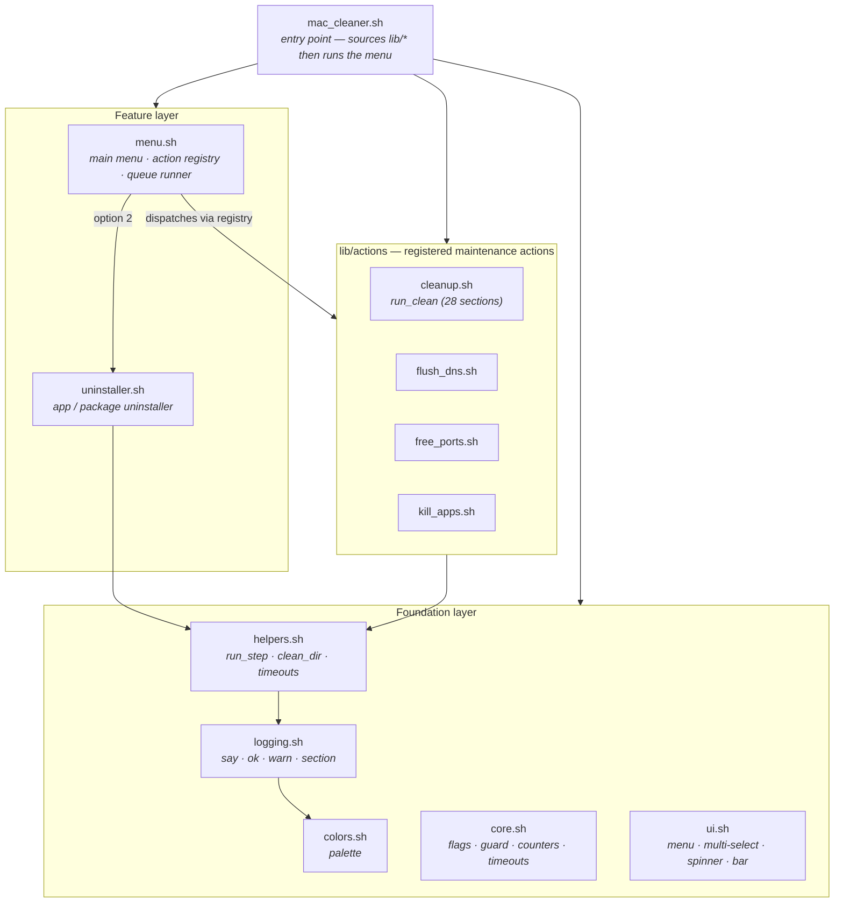
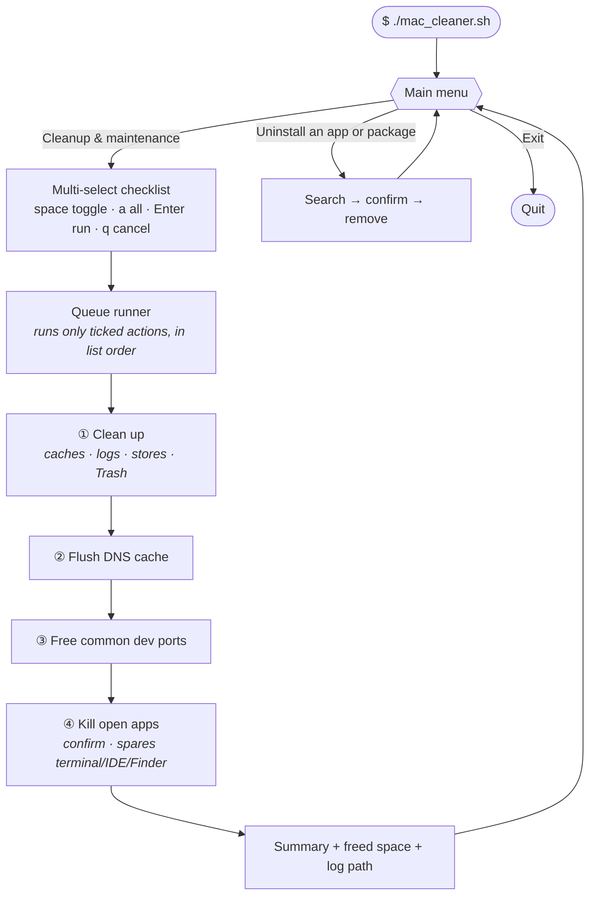

<div align="center">

# 🧹 macos-cleaner

**A safe, comprehensive macOS disk-space cleaner & maintenance toolkit for developers.**

Reclaim gigabytes of caches, logs, and package-manager stores — then flush DNS,
free stuck dev ports, and quit open apps, all from one colorful interactive menu.

[](https://www.apple.com/macos/)
[](https://www.gnu.org/software/bash/)
[](LICENSE)
[](#-safety-what-it-never-touches)

</div>

---

## Table of contents

- [What is it?](#what-is-it)
- [Highlights](#-highlights)
- [Architecture](#-architecture)
- [How it works](#-how-it-works)
- [Requirements](#-requirements)
- [Installation](#-installation)
- [Usage](#-usage)
- [Cleanup & maintenance actions](#-cleanup--maintenance-actions)
- [What the full cleanup cleans](#-what-the-full-cleanup-cleans)
- [Safety: what it never touches](#-safety-what-it-never-touches)
- [Configuration](#-configuration)
- [Logging](#-logging)
- [Timeout behaviour](#-timeout-behaviour)
- [Project structure](#-project-structure)
- [Contributing](#-contributing)
- [License](#-license)

---

## What is it?

`macos-cleaner` is a single, dependency-free bash program that frees disk space and
performs routine maintenance on a developer's Mac. It targets the caches, logs, and
package-manager stores that pile up across **every major language and tool ecosystem**
(Node, Python, Go, Rust, Java, Ruby, PHP, .NET, Swift/Xcode, Docker, Homebrew, and more)
and empties them in a single run — while **never deleting a single personal file**.

Beyond cleaning, it bundles three opt-in maintenance actions developers reach for
constantly: **flushing the DNS cache**, **freeing common dev-server ports** that a crashed
process left bound, and **quitting open apps** (safely sparing your terminal, editor, and Finder).

Everything runs behind an **arrow-key TUI** with a multi-select checklist, live progress
bars, spinners, and a full timestamped log of every command, exit code, and byte freed.

---

## ✨ Highlights

- 🧰 **One run, every toolchain** — 28 cleanup sections spanning Trash, browser caches, Xcode,
  Homebrew, and the package managers / build caches of 15+ languages.
- ✅ **Safe by design** — only caches, logs, and regenerable stores are removed. Personal
  files, app data, and downloaded models are never touched.
- ☑️ **Multi-select menu** — pick exactly which actions to run; selected items execute as an
  ordered queue with progress feedback.
- 🌐 **Maintenance actions** — flush DNS, free common dev ports, and force-quit apps (with guardrails).
- 🗑️ **Built-in uninstaller** — search every install location for an app/package and remove it
  along with its support files, preferences, caches, and launch agents.
- ⏱️ **Timeout watchdog** — no step can hang the run; timed-out steps are logged and skipped.
- 📝 **Full audit log** — every command, stdout/stderr, exit code, elapsed time, and freed space.
- 🐚 **Zero dependencies** — runs on the bash 3.2 that ships with macOS. No installs required.

---

## 🏗 Architecture

The program is split into small, single-responsibility modules. A thin entry point
(`mac_cleaner.sh`) resolves its own directory and sources the `lib/` modules in dependency
order, then launches the menu. Adding a new maintenance action means dropping one file in
`lib/actions/` and adding one row to the registry in `menu.sh` — nothing else changes.



---

## 🔄 How it works

From the main menu you either build a **queue of maintenance actions** (multi-select) or run
the **uninstaller**. Selected actions always execute **top-to-bottom in list order**, regardless
of the order you ticked them, and the menu loops back afterwards so you can chain operations.



---

## 📋 Requirements

| Requirement | Notes |
|---|---|
| **macOS 12+** | Tested up to macOS 26 (Tahoe) |
| **bash 3.2+** | Ships with macOS — nothing to install |
| **sudo** | Only for system-cache, DNS-flush, and Time Machine steps — you are prompted |

### Optional but recommended

```bash
brew install coreutils   # provides gtimeout → more reliable per-command timeouts
```

---

## 📦 Installation

Clone the repository (the entry script loads its modules from the adjacent `lib/` folder, so a
lone `mac_cleaner.sh` will not work):

```bash
git clone https://github.com/bafsheh/macos-cleaner.git
cd macos-cleaner
chmod +x mac_cleaner.sh
```

---

## ▶️ Usage

```bash
./mac_cleaner.sh
```

You'll land on the main menu:

```
  ╔══════════════════════════════════════════════════════╗
  ║   macOS Cleaner  ·  v1.0.0                            ║
  ╠══════════════════════════════════════════════════════╣
  ║   Safe disk-space cleaner for developers             ║
  ║   Disk: 249Gi free of 460Gi                          ║
  ╚══════════════════════════════════════════════════════╝

  What would you like to do?
  ❯  Cleanup & maintenance   (clean · DNS · ports · kill apps)
     Uninstall an app or package
     Exit
```

Choosing **Cleanup & maintenance** opens a checklist. Toggle items with **space**, select
everything with **a**, run with **Enter**, cancel with **q**:

```
  Cleanup & maintenance — choose actions to run
  ↑ ↓ move  ·  space toggle  ·  a all  ·  Enter run  ·  q cancel

  ❯  [✓]  Clean up           (caches · logs · package stores · Trash)
     [ ]  Flush DNS cache
     [✓]  Free common dev ports
     [ ]  Kill all open apps  (spares terminals · IDE · Finder)
```

> Run non-interactively (e.g. piped) and the menu falls back to a numbered prompt, so the tool
> still works in scripts and over SSH.

---

## 🧭 Cleanup & maintenance actions

Selected actions run as a queue, **in the order listed below**, with a progress bar between steps.

| Action | What it does | Safety |
|---|---|---|
| **Clean up** | Runs the full disk cleanup — all sections in the [table below](#-what-the-full-cleanup-cleans) | Never touches personal files |
| **Flush DNS cache** | `sudo dscacheutil -flushcache` + restart `mDNSResponder` | Requires sudo |
| **Free common dev ports** | Force-kills processes listening on a curated list of dev ports (`3000`, `5173`, `8080`, `9229`, …) | Scoped to known dev ports only — never targets `sshd`, system services, or this shell (`$$`) |
| **Kill all open apps** | Quits visible GUI apps — graceful quit first, force-kill as fallback | **Always spares** terminal emulators, code editors / IDEs, and Finder; background & menu-bar agents are excluded; **prompts for confirmation** first |

> **Kill all open apps** requires an interactive `y/N` confirmation. In a non-interactive
> context it **skips by default** — set `KILL_APPS_ASSUME_YES=1` to opt in.

---

## 🧽 What the full cleanup cleans

| # | Section |
|---|---------|
| 0 | Pre-run disk usage report (informational) |
| 1 | Trash — user + all mounted volumes |
| 2 | User Library caches and logs |
| 3 | Browser caches — Safari, Chrome, Firefox, Brave, Arc |
| 4 | Xcode — DerivedData, Archives, iOS DeviceSupport, Simulator |
| 5 | Swift PM · CocoaPods · Carthage · Mint |
| 6 | Homebrew — autoremove orphan deps, cleanup, logs |
| 7 | JavaScript / Node.js package managers — npm, yarn, pnpm, bun, deno, volta, nvm, turbo |
| 8 | JavaScript project-level caches — .next/cache, .turbo, .parcel-cache, jest, eslintcache |
| 9 | Python package managers — pip, uv, poetry, pipenv, hatch, pdm, pyenv, conda/mamba |
| 10 | Python project-level caches — \_\_pycache\_\_, .pytest\_cache, .mypy\_cache, .ruff\_cache |
| 11 | Go — build, module, test, and fuzz caches |
| 12 | Rust — Cargo registry/git, rustup, sccache |
| 13 | C / C++ — ccache, Conan v1/v2, vcpkg |
| 14 | Ruby — gem cleanup, Bundler cache |
| 15 | PHP — Composer, PHPStan, Psalm, PHP-CS-Fixer |
| 16 | .NET — NuGet local caches |
| 17 | Java / JVM / Kotlin / Spring — Gradle, Maven, SBT, Ivy2, SDKMAN |
| 18 | Android — SDK cache, incremental build cache |
| 19 | Docker — unused images (`-a`), build cache, optional volume prune |
| 20 | Infra / Cloud / DevOps — Terraform, Pulumi, Ansible, kubectl, minikube, AWS, GCP, Azure |
| 21 | Local DB dev logs — Postgres.app, DBngin, Redis (data dirs never touched) |
| 22 | Code editors / IDEs — VS Code, Cursor, Windsurf, JetBrains, Sublime, Zed, Nova |
| 23 | AI assistants — ChatGPT, Perplexity, LM Studio, Ollama, Jan, Tabnine, Amazon Q, Cody, Gemini, Warp, Mistral, Groq, Copilot |
| 24 | Mail caches |
| 25 | Time Machine local (on-disk) snapshots |
| 26 | Quick Look thumbnails · old iOS/iPadOS update files |
| 27 | System caches and logs (sudo) |
| 28 | Old /tmp items (>3 days) |
| — | Post-run disk usage report + summary |

---

## 🛡 Safety: what it never touches

- **Personal files** — Documents, Desktop, Downloads, Pictures, Music, Movies
- **Docker named volumes** — may contain database data; pruned only on a separate opt-in prompt
- **Ollama / LM Studio models** — user-downloaded weights; too large and intentional to remove
- **Maven local repository** — only the metadata `.cache` subdir is removed, not your packages
- **Homebrew formulae** — only the download cache is cleared, never installed software
- **`sshd` / system services** — "Free dev ports" is scoped to a curated dev-port list
- **Your terminal, editor, and Finder** — always spared by "Kill all open apps"

---

## ⚙️ Configuration

All behaviour is tunable via environment variables — no config file needed.

| Variable | Default | Description |
|---|---|---|
| `CMD_TIMEOUT` | `60` | Per-command timeout in seconds |
| `DIR_TIMEOUT` | `120` | Per-directory delete timeout in seconds |
| `SCAN_TIMEOUT` | `60` | Project-scan `find` timeout in seconds |
| `PY_SCAN_ROOTS` | auto | Space-separated dirs for the Python project-cache scan |
| `JS_SCAN_ROOTS` | auto | Space-separated dirs for the JS project-cache scan |
| `KILL_APPS_ASSUME_YES` | `0` | Set to `1` to allow "Kill all open apps" to run non-interactively |

```bash
# examples
CMD_TIMEOUT=30 ./mac_cleaner.sh
PY_SCAN_ROOTS="$HOME/src $HOME/work" ./mac_cleaner.sh
```

---

## 📝 Logging

Every run writes a full timestamped log to:

```
/tmp/mac_cleaner_YYYYMMDD_HHMMSS.log
```

The log captures stdout/stderr from every command, exit codes, elapsed times, and
freed-space measurements — so you can always review exactly what happened.

---

## ⏲ Timeout behaviour

Each step runs under a timeout watchdog (`gtimeout` → `timeout` → a pure-bash fallback).
A timed-out step is marked in the log and counted separately in the summary — **it never
aborts the rest of the run**.

---

## 🗂 Project structure

```
mac_cleaner.sh          # thin entry point — sources lib/* then shows the menu
lib/
├─ colors.sh            # color / style palette
├─ core.sh              # runtime flags, macOS guard, counters, tunable timeouts
├─ logging.sh           # say · step · info · ok · warn · fail · section
├─ helpers.sh           # disk + execution helpers (run_step, clean_dir, run_timeout, …)
├─ ui.sh                # interactive_menu · interactive_multiselect · spinner · progress_bar
├─ uninstaller.sh       # app / package uninstaller
├─ menu.sh              # main menu · action registry · queue runner
└─ actions/
   ├─ cleanup.sh        # full disk cleanup (run_clean — 28 sections)
   ├─ flush_dns.sh      # flush the DNS cache
   ├─ free_ports.sh     # free common dev ports
   └─ kill_apps.sh      # quit open apps (spares terminals / IDE / Finder)
```

---

## 🤝 Contributing

Bug reports and PRs are welcome. When adding a new cache path, please include:

- The tool name and version where you confirmed the path
- The macOS version where you tested it

When adding a new **maintenance action**, drop a file in `lib/actions/` exposing a single
entry function, then register it in the parallel `ACTION_*` arrays in `lib/menu.sh`.

---

## 📄 License

[MIT](LICENSE) © macos-cleaner contributors
